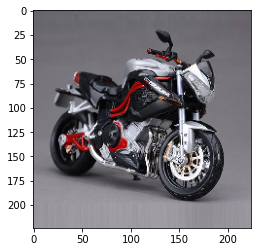
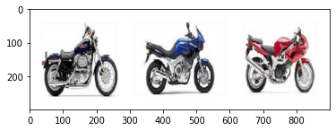

```python
### Author : Vinh Pham
import os
import requests
import glob
import urllib.request
import tempfile,io
import shutil
import tarfile
import json
from peewee import *
import peewee
from playhouse.sqlite_ext import *
from playhouse.db_url import connect
import numpy as np
import matplotlib.pyplot
from matplotlib.pyplot import imshow
import keras
from keras.preprocessing import image
from keras.applications.imagenet_utils import decode_predictions, preprocess_input
from keras.models import Model
import efficientnet.keras as efn 


```

    Using TensorFlow backend.


```python
### call pretrained

model = keras.applications.VGG16(weights='imagenet', include_top=True)
model.summary()
```

    Model: "vgg16"
    _________________________________________________________________
    Layer (type)                 Output Shape              Param #   
    =================================================================
    input_4 (InputLayer)         (None, 224, 224, 3)       0         
    _________________________________________________________________
    block1_conv1 (Conv2D)        (None, 224, 224, 64)      1792      
    _________________________________________________________________
    block1_conv2 (Conv2D)        (None, 224, 224, 64)      36928     
    _________________________________________________________________
    block1_pool (MaxPooling2D)   (None, 112, 112, 64)      0         
    _________________________________________________________________
    block2_conv1 (Conv2D)        (None, 112, 112, 128)     73856     
    _________________________________________________________________
    block2_conv2 (Conv2D)        (None, 112, 112, 128)     147584    
    _________________________________________________________________
    block2_pool (MaxPooling2D)   (None, 56, 56, 128)       0         
    _________________________________________________________________
    block3_conv1 (Conv2D)        (None, 56, 56, 256)       295168    
    _________________________________________________________________
    block3_conv2 (Conv2D)        (None, 56, 56, 256)       590080    
    _________________________________________________________________
    block3_conv3 (Conv2D)        (None, 56, 56, 256)       590080    
    _________________________________________________________________
    block3_pool (MaxPooling2D)   (None, 28, 28, 256)       0         
    _________________________________________________________________
    block4_conv1 (Conv2D)        (None, 28, 28, 512)       1180160   
    _________________________________________________________________
    block4_conv2 (Conv2D)        (None, 28, 28, 512)       2359808   
    _________________________________________________________________
    block4_conv3 (Conv2D)        (None, 28, 28, 512)       2359808   
    _________________________________________________________________
    block4_pool (MaxPooling2D)   (None, 14, 14, 512)       0         
    _________________________________________________________________
    block5_conv1 (Conv2D)        (None, 14, 14, 512)       2359808   
    _________________________________________________________________
    block5_conv2 (Conv2D)        (None, 14, 14, 512)       2359808   
    _________________________________________________________________
    block5_conv3 (Conv2D)        (None, 14, 14, 512)       2359808   
    _________________________________________________________________
    block5_pool (MaxPooling2D)   (None, 7, 7, 512)         0         
    _________________________________________________________________
    flatten (Flatten)            (None, 25088)             0         
    _________________________________________________________________
    fc1 (Dense)                  (None, 4096)              102764544 
    _________________________________________________________________
    fc2 (Dense)                  (None, 4096)              16781312  
    _________________________________________________________________
    predictions (Dense)          (None, 1000)              4097000   
    =================================================================
    Total params: 138,357,544
    Trainable params: 138,357,544
    Non-trainable params: 0
    _________________________________________________________________


```python
## create feature extractor
feature_extractor = Model(inputs=model.input, outputs=model.get_layer("fc2").output)
feature_extractor.summary()
def get_image(path):
    img = keras.preprocessing.image.load_img(path, target_size=model.input_shape[1:3])
    x = keras.preprocessing.image.img_to_array(img)
    x = np.expand_dims(x, axis=0)
    x = preprocess_input(x)
    return img, x
```

    Model: "model_3"
    _________________________________________________________________
    Layer (type)                 Output Shape              Param #   
    =================================================================
    input_4 (InputLayer)         (None, 224, 224, 3)       0         
    _________________________________________________________________
    block1_conv1 (Conv2D)        (None, 224, 224, 64)      1792      
    _________________________________________________________________
    block1_conv2 (Conv2D)        (None, 224, 224, 64)      36928     
    _________________________________________________________________
    block1_pool (MaxPooling2D)   (None, 112, 112, 64)      0         
    _________________________________________________________________
    block2_conv1 (Conv2D)        (None, 112, 112, 128)     73856     
    _________________________________________________________________
    block2_conv2 (Conv2D)        (None, 112, 112, 128)     147584    
    _________________________________________________________________
    block2_pool (MaxPooling2D)   (None, 56, 56, 128)       0         
    _________________________________________________________________
    block3_conv1 (Conv2D)        (None, 56, 56, 256)       295168    
    _________________________________________________________________
    block3_conv2 (Conv2D)        (None, 56, 56, 256)       590080    
    _________________________________________________________________
    block3_conv3 (Conv2D)        (None, 56, 56, 256)       590080    
    _________________________________________________________________
    block3_pool (MaxPooling2D)   (None, 28, 28, 256)       0         
    _________________________________________________________________
    block4_conv1 (Conv2D)        (None, 28, 28, 512)       1180160   
    _________________________________________________________________
    block4_conv2 (Conv2D)        (None, 28, 28, 512)       2359808   
    _________________________________________________________________
    block4_conv3 (Conv2D)        (None, 28, 28, 512)       2359808   
    _________________________________________________________________
    block4_pool (MaxPooling2D)   (None, 14, 14, 512)       0         
    _________________________________________________________________
    block5_conv1 (Conv2D)        (None, 14, 14, 512)       2359808   
    _________________________________________________________________
    block5_conv2 (Conv2D)        (None, 14, 14, 512)       2359808   
    _________________________________________________________________
    block5_conv3 (Conv2D)        (None, 14, 14, 512)       2359808   
    _________________________________________________________________
    block5_pool (MaxPooling2D)   (None, 7, 7, 512)         0         
    _________________________________________________________________
    flatten (Flatten)            (None, 25088)             0         
    _________________________________________________________________
    fc1 (Dense)                  (None, 4096)              102764544 
    _________________________________________________________________
    fc2 (Dense)                  (None, 4096)              16781312  
    =================================================================
    Total params: 134,260,544
    Trainable params: 134,260,544
    Non-trainable params: 0
    _________________________________________________________________


```python
### create database (peewee -  https://github.com/coleifer/peewee)
## initialize db
db = SqliteDatabase('./images.db')


class VectorField(BlobField):
    db_field = 'vector'
### details - https://github.com/coleifer/peewee/blob/master/peewee.py
    def db_value(self, value):
        out = io.BytesIO()
        np.save(out, value)
        out.seek(0)
        return out.read()  # zlib, bz2

    def python_value(self, value):
        out = io.BytesIO(value)
        out.seek(0)
        
        return np.load(out)


class BaseModel(peewee.Model):
    class Meta:
        database = db

class ObjectFeature(BaseModel):
    id = BigIntegerField(primary_key=True, unique=True)
    classify = TextField()
    link = TextField()
    vector = VectorField()
    

db.create_tables([ObjectFeature])
```


```python
### download data if not exits
respurl = "http://www.vision.caltech.edu/Image_Datasets/Caltech101/101_ObjectCategories.tar.gz"
with requests.get(respurl,stream = False) as File:
    # stream = true is required by the iter_content below
    with tempfile.NamedTemporaryFile(delete=True) as tmp_file:
        with open(tmp_file.name,'wb') as fd:
            for chunk in File.iter_content(chunk_size=128):
                fd.write(chunk)

with tarfile.open(tmp_file.name,"r:gz") as tf:
    # To save the extracted file in directory of choice with same name as downloaded file.
    tf.extractall('./')
    # for loop for parsing json inside tar.gz file.
    for tarinfo_member in tf:
        print("tarfilename", tarinfo_member.name, "is", tarinfo_member.size, "bytes in size and is", end="")
        if tarinfo_member.isreg():
            print(" a regular file.")
        elif tarinfo_member.isdir():
            print(" a directory.")
        else:
            print(" something else.")
        if os.path.splitext(tarinfo_member.name)[1] == ".json":
            print("json file name:",os.path.splitext(tarinfo_member.name)[0])
            json_file = tf.extractfile(tarinfo_member)
            # capturing json file to read its contents and further processing.
            content = json_file.read()
            json_file_data = json.loads(content)
            print("Status Code",json_file_data[0]['status_code'])
            print("Response Body",json_file_data[0]['response'])
            # Had to decode content again as it was double encoded.
            print("Errors:",json.loads(json_file_data[0]['response'])['errors'])

```


```python
### extract feature from image and save to database

for image_ in glob.glob('./101_ObjectCategories/*/*'):
    img, x = get_image(image_);
    feat = feature_extractor.predict(x)[0]
    temp = ObjectFeature(classify=image_.split('/')[-2], vector =feat,link=image_)
    temp.save()
```


```python
### create search engine (with faiss)
### search with index IVF no compress (IVFFlat)
import faiss
def train(xb,nlist = 300,path = './vector.index'):
    d = xb.shape[1]
    quantizer = faiss.IndexFlatL2(d)  # the other index
    index = faiss.IndexIVFFlat(quantizer, d, nlist)
    index.train(xb)
    
    faiss.write_index(index,path)
    return path
    # build the index
def search(xb,xq,k = 10, nprobe=1,path='./vector.index'):
     ## return 10 nearest neighbours
    index = faiss.read_index(path)
    index.add(xb) 
    # actual search
    index.nprobe = nprobe            # default nprobe is 1, try a few more- find most 10 similar
    D, I = index.search(xq, k)
    return D,I
```


```python
### main 
## get data from database into array
base_vector = []
base_id = []
for img in ObjectFeature.select():
    base_vector.append(img.vector)
    base_id.append(img.id)
    
xb = np.stack(base_vector)


```


```python
### extract vector from image search
img, x = get_image('./motobike.jpg');
vector_to_search = feature_extractor.predict(x)[0]
```


```python
### train
nlist = len(glob.glob('./101_ObjectCategories/*'))
print(nlist)
train(xb,nlist=nlist)
```

    102


    './vector.index'


```python
### search vector 
vector_to_search=vector_to_search.reshape(1,4096)

D,I = search(xb,vector_to_search,k=3)
print(D,I)
image_indices = I[0]
image_dir = glob.glob('./101_ObjectCategories/*/*')
```

    [[3495.5322 3520.1748 3658.9836]] [[7150 7076 6681]]


```python
links = []
for index in I[0]:
    for e in ObjectFeature.select().where(ObjectFeature.id==base_id[index]):
        img,x =get_image(e.link)
        links.append(img)
```


```python
def get_concatenated_images(indexes, thumb_height):
    thumbs = []
    for img in indexes:
        
        img = img.resize((int(img.width * thumb_height / img.height), thumb_height))
        thumbs.append(img)
    concat_image = np.concatenate([np.asarray(t) for t in thumbs], axis=1)
    return concat_image

```


```python
## check image
import matplotlib.pyplot
from matplotlib.pyplot import imshow
img, x = get_image('./motobike.jpg');
imshow(img)
```


    <matplotlib.image.AxesImage at 0x1c71f9c10>





```python
results_image = get_concatenated_images(links, 300)
imshow(results_image)
```


    <matplotlib.image.AxesImage at 0x1bd5cf3d0>





```python

```
